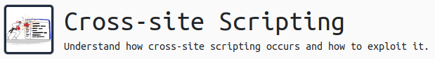

# Cross Site Scripting - A Walkthrough by 4ngryb34r
This room is available on [TryHackMe.com](https://tryhackme.com/room/xss)


## TASK 1
Just read it and hit the button!


## TASK 2 -- Deploy your XSS Playground
Deploy the box, read the text, hit the button. Done.
It says, `You do not need to be connected to our network to deploy and access this.`
I have no idea why it says that or what it means. You most definitely do have to be connected to the network to access the machine, so just ignore this.


## TASK 3 -- Stored XSS
### Question 1
No answer needed, but you might want to create an account on this XSS website we just deployed. I used `user` for the username and `pass` for the password. Yeah, I know, that's some real out-of-the-box thinking.

### Question 2
Make sure you have your account created, and you are logged in. Click the `Stored XSS` link at the top of the page.
Don't overcomplicate this. The question is just asking if you could possibly insert any HTML tags in the input box. You don't have to be clever and actually add some HTML to the DOM using some complicated code or anything fancy. Just enter some HTML in the input and click the button. For example, you could just enter a paragraph tag: 
```
<p>HEY, it's HTML!!</p>
```
and be done with it. Just about any HTML tag should do the trick here. You should get a flag that shows up in a green box.

### Question 3
Pretty simple here, too. We just need to enter something as a comment that will make a popup box appear on the page with the content of our cookie when the page loads. JavaScript to the rescue!! It is cross-site *scripting*, after all.
So, let's just try doing 
```
<script>alert(document.cookie)</script>
```
We should see the contents of our cookie in an alert box, then as soon as we close that, another alert should pop up with our flag. YAY!

### Question 4
Still simple, but has a couple steps. First, we need to look at the HTML source and see where that text we are supposed to change is, and figure out how to change it using some JavaScript.
OK, so we found it. Conveniently, it is surrounded by a span tag with an id attribute. That makes it super easy to change with our script. We can use the getElementById method of the document and the innerHTML property of that element to change the contents of that span.
```
<script>document.getElementById('thm-title').innerHTML="I am a hacker"</script>
```
When we submit this, we are going to see the popups from the previous question because this is *stored* XSS. The things we do will show up on every subsequent load of the page. If we have done this one correctly, you should see your answer in red text next to the number 3 instructions on the XSS playground page.

### Question 5
OK, now we are getting somewhere. Remember when we just displayed the contents of our cookie in an alert? That was pretty useless because it's *OUR* cookie. What if we want some other user's cookie so we could be seen as them on the system? We can do that!!
In a real-world situation, we would set up a web server that would capture the requests that the comment we are about to put on the site is going to cause every user's browser to make. In this room, however, there is an easier method. Every request sent to /log/some_value_here will enter `some_value_here` to the logs which can be viewed on the /logs page. Super!!
We need to be a bit careful, here. If we do what is suggested and modify the location, then every time we go to the page from now on it will try to forward us to that location. It's would also be a bit too obvious to the other users that something strange is going on.
Let's just do an img tag instead.
```

```
This will steal the user's cookie and send it to the logs page.

### Question 6
Now that we have Jack's cookie, we can become Jack!  We just copy it and replace our cookie with Jack's cookie value, refresh the page, and enter a new comment. If we did everything correctly, we will see a new comment from Jack and our new answer flag will show up on the page, too!!


## TASK 4 -- Reflected XSS
I would have liked to have seen this task as number 3, and move the slightly more complicated Stored XSS to this task, but it is what it is.
To start, click the Reflected XSS link at the top of the XSS Playground page.
This time, we are interacting with a search feature. Let's see what it does. Enter some text in the search box -- I used `blahblahblah`. When we hit the Search button we see the text `You searched for: blahblahblah` Behavior like this is a good clue that the page might be vulnerable to reflected XSS.
The tasks here are simple, so let's get to it!

### Question 1
This is very similar to question 3 in the previous task. We just need to make an alert appear on the page. This should do the trick:  
```
<script>alert("Hello")</script>
```
You should see your popup that says Hello, and then another with your answer flag. 
This looks almost the same as the previous task, but there's an important difference. This time, our script isn't being stored anywhere, so the next time we visit this page it is *NOT* going to run our script. That is the main difference between Stored XSS and Reflected XSS.

### Question 2
Same deal here, just displaying different stuff. Let's do this!!
It's easy to overthink this, especially if you read the question the way I did. I assumed that I was supposed to get the *client* IP address, but that is not the case here. I'm not sure what value there would be to using javascript to get the IP of the server, but we can do it if that's what the task requires. Here we go.  
```
<script>alert(window.location.hostname)</script>
```
Technically, this returns the hostname of the server. It just happens in this case that there is no host *name* in this URL, so it returns the IP address as the hostname.


## TASK 5 -- DOM-Based XSS
In this task, we will be closely interacting with the legitimate javascript on the site. Click the `DOM-Based XSS` link at the top of the XSS Playground page. We see a page that is supposedly going to allow us to choose an image URL to be displayed on the page.  
  
How does this page work? The page code already contains a div element that will eventually contain the img tag when we supply a URL. The code looks like this: 
```
imgdiv.innerHTML = '' // Creating image element
```
Whatever we type into this text area will be stored in that `imgURL` variable in the code above. Since we control everything that goes in that part of the tag, we can play with the quotes and cause all sorts of stuff to happen.

### Question 1
The hint gives us something to try out.
```
test" onmouseover="alert('Hover over the image and inspect the image element')
```
What this is doing is applying `test` to the src attribute of the image tag, and closing that quote. Then it is starting an `onmouseover` event attribute. When we do this and mouse over the *broken* image, then we see the alert.  

Let's modify it and make it do what the task is asking for (document.cookie instead of that string):
```
xxx" onmouseover="alert(document.cookie)
```
That should give us the desired result. We could have chosen a number of different events rather than `onmouseover`. I personally prefer `onerror` for this example. Give it a try!

### Question 2
Almost the same deal here, except we are supposed to try using `onhover` instead, and change some property of the page instead of just displaying a popup.
```
xxx" onhover="document.body.style.backgroundColor='red'
```
You might have to play around with this one, it's a bit buggy for me. I had to end up doing it with an onmouseover I think. Play around and you'll eventually get it.


## TASK 6 -- Using XSS for IP and Port Scanning
No answers needed for this task, but you should definitely read the section and have some fun with the XSS Playground.


## TASK 7 -- XSS Keylogger
Same as above. Check out the XSS Playground page and click that XSS Keylogger link. Learn some stuff!


## TASK 8 -- Filter Evasion
So, this is probably the reason you're here. Do me a favor and at least read *some* of the garbage I wrote for the previous tasks. Please? This section is confusing because there are __*SO MANY*__ ways to do what it is asking you to do. Don't try to be clever. It won't work. You'll probably end up being way __*TOO*__ clever and not get the right answer.  
  
Part of the confusion here is that the room task instructions on THM don't fully explain what we are supposed to do. For that, we look at the XSS Playground page for Filter Evasion. We read that we are supposed to find a way to display a popup that says "Hello" for each question.
  
Anyways, let's get to it!

### Question 1
OK, this one seems easy enough, right? We've already done something like that in previous tasks.
```

```
Great! We get our answer flag right after we get our "Hello" popup. Moving right along!


### Question 2
To be honest, I was stuck here for WAAAAYYYY too long. I found literally *dozens* of ways to accomplish this, but none of them would give me the *right* answer. The secret is to have a look at the way the javascript filter of the page works. It's pretty simple once you read through it. There are loads of ways you could do this, but the site is looking for one of a couple pre-defined ways. Search for a way to make a popup without alert, and you'll find `prompt` and `confirm` are commonly used.
```

```
And, we should get our answer flag. If not, try changing the event trigger to `onmouseover` or `onhover`

### Question 3 
OK, after that one, this one should be a bit easier. We saw that the filter code is incredibly simplistic, and is just going to replace the filtered word with "". So, what if we embedded the filtered word within the filtered word?
```

```
The filter is going to replace the occurence of "Hello" in the inside of "HHelloello" and once that runs, the leftover string will be "Hello". Nifty!

### Question 4
Now it get's easier once we understand what this code is looking for! For this one, we just have to realize that the filter code sees `onerror`, but ignores `ONERROR`, which is still valid for our purposes.
```

```


## TASK 9 -- Protection Methods & Other Exploits
Definitely give this section a read and play around some more with XSS Playground. If you're ever going to be a web developer, XSS is something you __*NEED*__ to understand! It has overtaken SQLi as the number one attack vector for web applications, so we should be focusing a lot of our efforts there if we want secure web apps!

